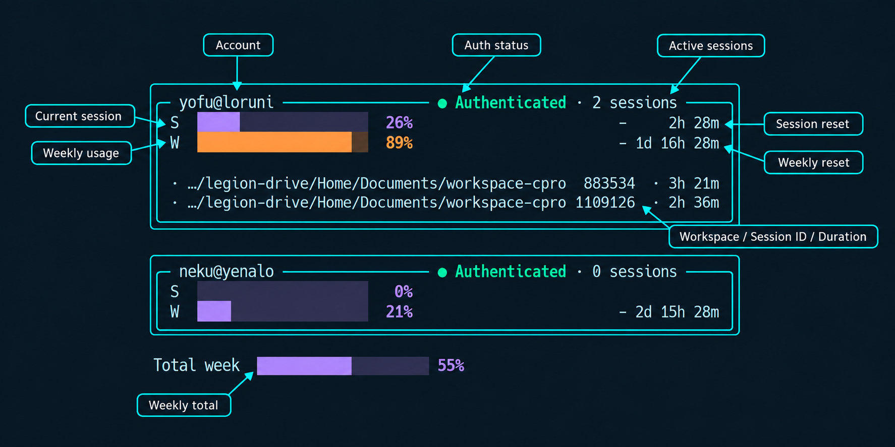
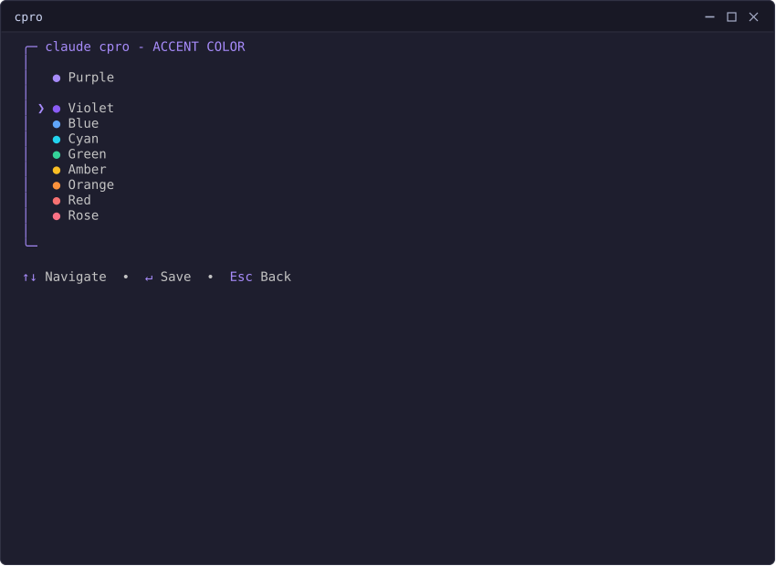
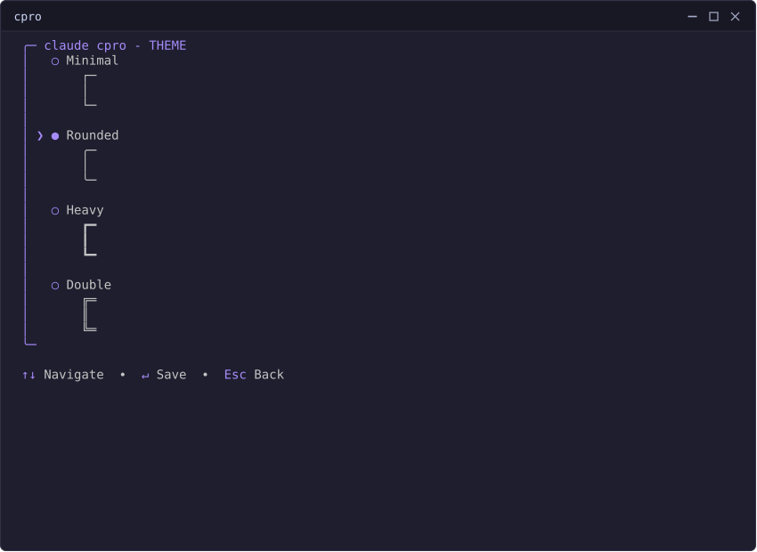
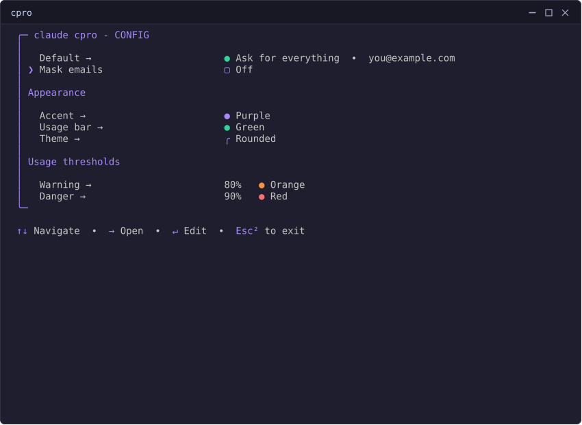

# cpro

**cpro** — short for **C**laude Code **Pro** — is a Linux CLI that manages
multiple Claude Code accounts. Each account keeps its own isolated
authentication, settings, and history.

It exists because the \$100/month Max plan isn't in everyone's budget, but
two \$20/month Pro subscriptions might be. cpro lets you switch between accounts
in seconds instead of juggling manual logins — and when one account hits its
usage limit mid-conversation, `cpro session continue` picks up that exact
same conversation under a different account, so you keep working instead of
waiting for a reset.

## What it does

1. **`cpro`** — opens the interactive launcher.
2. Select **`run`**.
3. Pick which account runs Claude Code.
4. Pick a permission mode — e.g. **YOLO**, which skips every prompt.
5. cpro hands off to `claude` with that account and mode.

That's the whole flow — no flags to memorize for everyday use:


## Install

Requirements: Linux, and `claude` on `PATH`.

Download the latest release binary — no Go toolchain needed:

```bash
curl -LO https://github.com/Mgldvd/cpro/releases/latest/download/cpro-linux-amd64  # or cpro-linux-arm64
chmod +x cpro-linux-amd64
./cpro-linux-amd64 install    # copies itself to ~/.local/bin/cpro
```

Or build from source (requires Go 1.25.8+):

```bash
go build -o bin/cpro ./src   # build
go install ./src             # install to $(go env GOPATH)/bin
```

## Quick start

```bash
cpro login you@example.com
cpro                         # interactive launcher: run / status / watch / menu
```

## Cool stuff you can do

### Watch your usage live

`cpro watch` redraws every account's Session/Week usage right in your
terminal on an interval — the bar recolors itself as it climbs:


Every field on that card, explained:



### Make it yours

cpro's UI is genuinely configurable, not decoration you can't touch.

**Accent, usage bar, warning, and danger colors** —
`cpro config accent|bar|warning-color|danger-color COLOR`, all from the same
palette:



**Theme** — `cpro config theme NAME` swaps the border style (Minimal,
Rounded, Heavy, Double) — this one's genuinely fun to play with:



**Mask emails** — `cpro config mask on` replaces every email cpro shows with
a random placeholder, so you can stream or demo without revealing your real
accounts:



## Documentation

See [`docs/README.md`](docs/README.md) for every command and what it's for.

## Verification

```bash
go build -o bin/cpro ./src
go vet ./...
go test ./...
```

## License

Dual-licensed under either of [Apache License, Version 2.0](LICENSE-APACHE) or
[MIT license](LICENSE-MIT), at your option.
