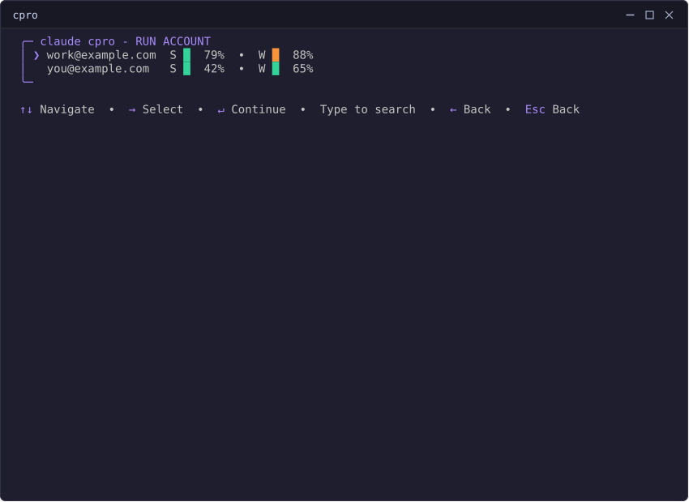
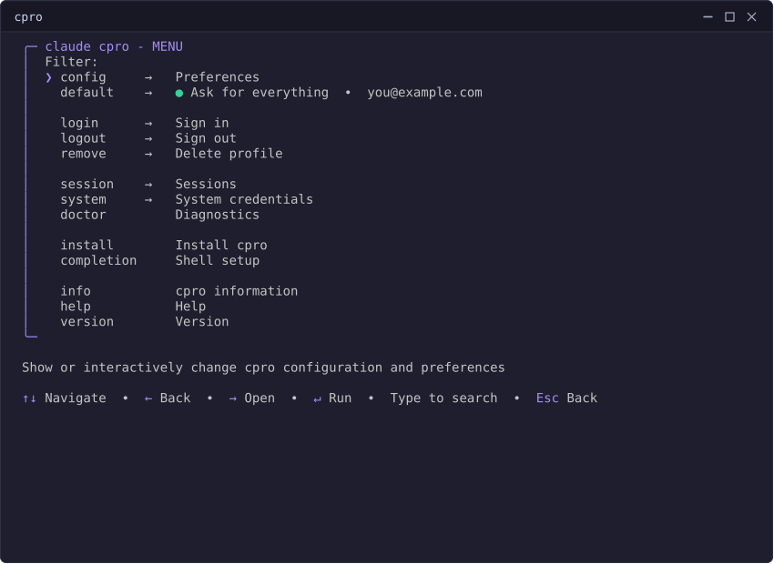
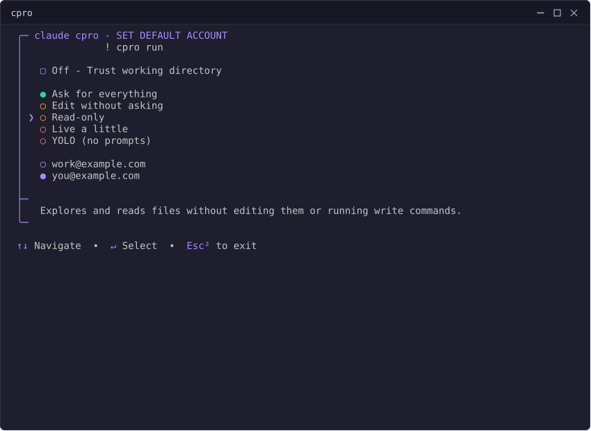
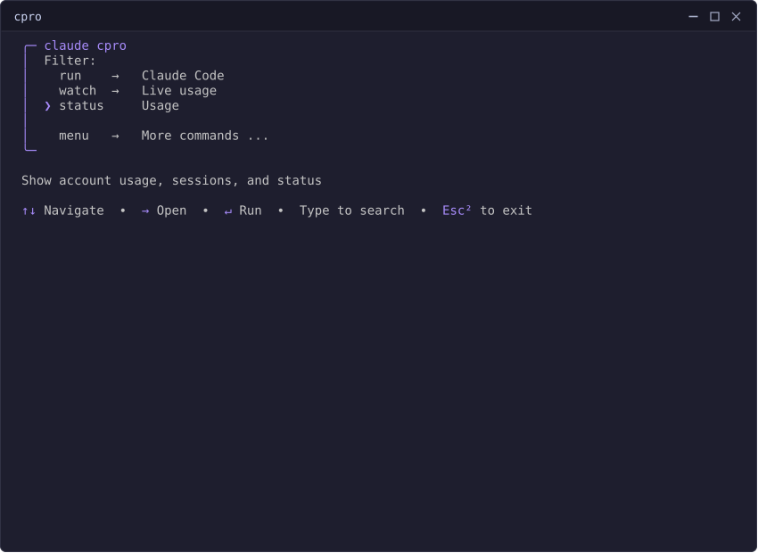
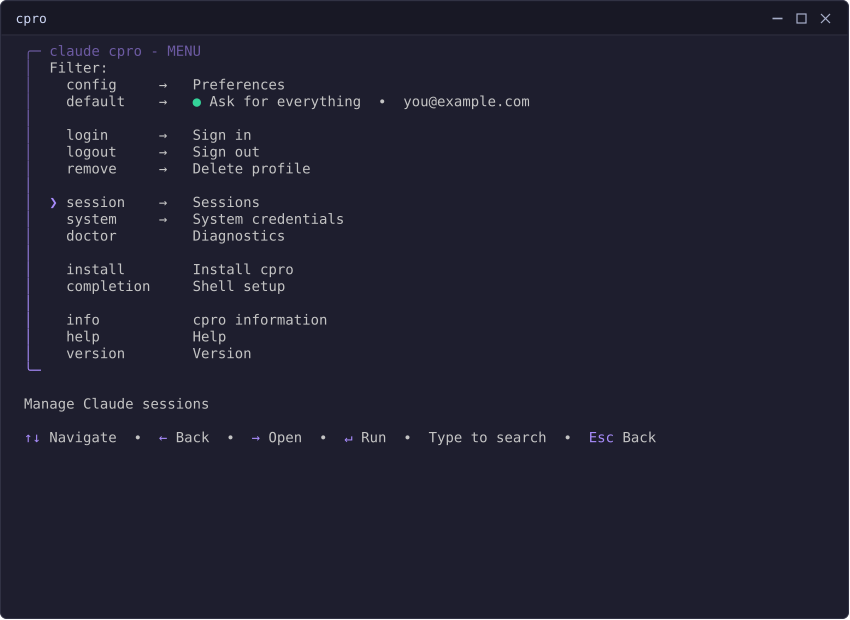
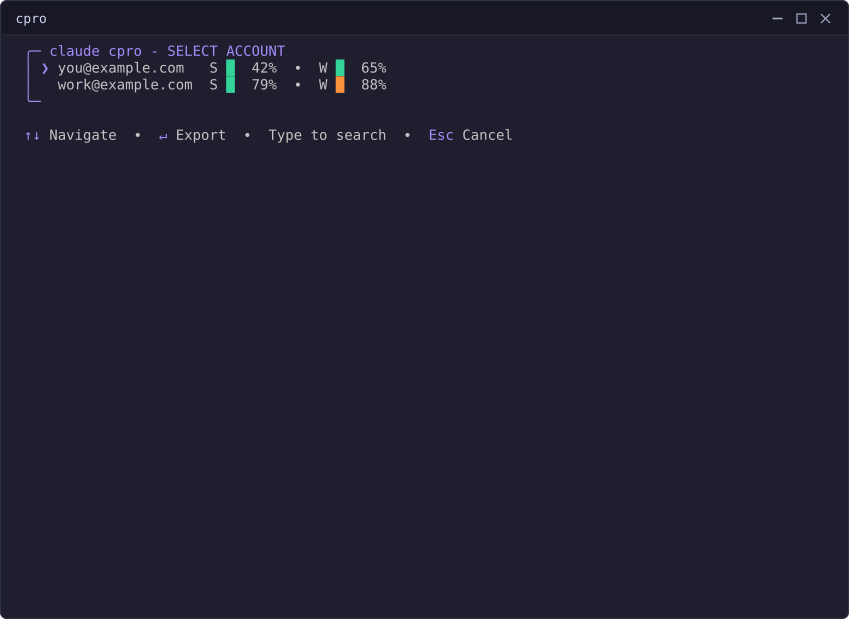
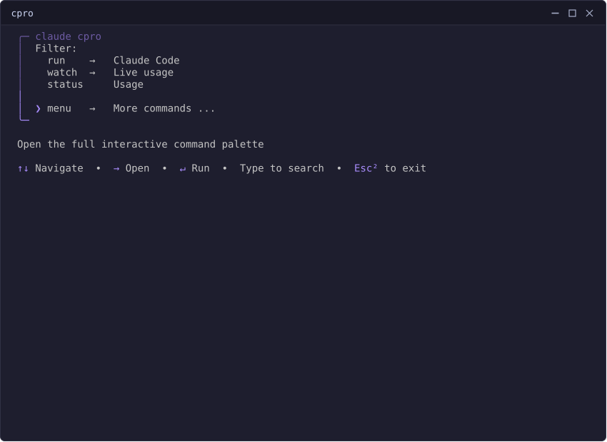

# cpro

**cpro** — short for **C**laude Code **Pro** — is a Linux CLI that manages
multiple Claude Code accounts by email — each with its own isolated login,
settings, and history.


## Install

Download the latest release binary — no Go toolchain needed:

```bash
curl -LO https://github.com/Mgldvd/cpro/releases/latest/download/cpro-linux-amd64  # or cpro-linux-arm64
chmod +x cpro-linux-amd64
./cpro-linux-amd64 install    # copies itself to ~/.local/bin/cpro
```

Or build from source (requires Go 1.25.8+):

```bash
go build -o bin/cpro ./src   # build
go install ./src             # install to $(go env GOPATH)/bin
cpro install                 # (once built) copy the running binary to ~/.local/bin/cpro
```

## Quick start

```bash
cpro login you@example.com   # sign in
cpro                         # bare cpro opens the launcher: run / status / watch / menu
cpro run                     # or run non-interactively
```

## Commands

| Command | What it's for |
|---|---|
| `cpro` | interactive launcher — run / status / watch / menu |
| `cpro menu` | full interactive command palette |
| `cpro login EMAIL` | sign in / register an account |
| `cpro logout EMAIL` | sign out, keep the local profile |
| `cpro remove EMAIL [--yes]` | delete a local profile and its history |
| `cpro list` (`ls`) `[--json]` | quick account + auth-state listing |
| `cpro status [--json] [--compact]` | usage, sessions, and auth dashboard |
| `cpro watch [--interval DURATION] [--compact]` | `status` on a loop |
| `cpro run [--account EMAIL] [-- CLAUDE ARGS]` | launch Claude Code |
| `cpro --resume ID` / `-r ID [--account EMAIL]` | resume a specific session |
| `cpro session` | sessions menu |
| `cpro session continue [FROM TO] [-- CLAUDE ARGS]` | copy a session to another account and resume it |
| `cpro session list [--json]` | list every recorded session |
| `cpro session delete ID... [--yes] [--account EMAIL]` | permanently delete session transcripts |
| `cpro system export [EMAIL]` | send a cpro account's credentials to the system `claude` |
| `cpro system import` | pull the system `claude`'s credentials into cpro |
| `cpro config [--json]` | show, or interactively edit, preferences |
| `cpro default` | interactively set run defaults: permission mode, workspace trust, account |
| `cpro doctor` | diagnostic checks |
| `cpro install` | copy this binary to `~/.local/bin/cpro` |
| `cpro info` | read-only installation snapshot |
| `cpro version` | print the version |

`cpro run` is always non-interactive — it never prompts. For the interactive
account/mode picker, run bare `cpro` and select "run".



### `cpro run` with your default mode

Set a default account and permission mode once — via `cpro default`
(interactive) or `cpro config account EMAIL`/`cpro config permission-mode
MODE` (scriptable) — and bare `cpro run` uses them immediately, skipping the
RUN ACCOUNT / RUN MODE step-by-step above entirely:

```bash
cpro config account you@example.com
cpro config permission-mode yolo
cpro run                        # no picker — launches straight away
```

An explicit `--account EMAIL` or a forwarded `--permission-mode`/
`--dangerously-skip-permissions` flag still overrides the saved default for
that one invocation, without changing what's saved.

### `cpro config` subcommands

Every interactive preference also has a scriptable equivalent:

| Command | Sets |
|---|---|
| `cpro config trust {on\|off}` | skip Claude's folder-trust prompt |
| `cpro config mask {on\|off}` | mask emails behind a random placeholder |
| `cpro config account EMAIL` | the default account `cpro run` uses |
| `cpro config permission-mode MODE [--account EMAIL]` | the default permission mode, globally or per account |
| `cpro config accent\|bar\|warning-color\|danger-color COLOR` | a UI color |
| `cpro config theme NAME` | the TUI border style |
| `cpro config warn-at\|danger-at PERCENT` | the usage-bar color thresholds |



### Permission modes

| Mode | Flag `cpro run` sends | What it does |
|---|---|---|
| `ask` | *(none)* | Prompts before every tool use — the default |
| `edit` | `--permission-mode acceptEdits` | Auto-approves file edits in the working directory |
| `readonly` | `--permission-mode plan` | Reads/explores only, no edits or commands |
| `live` | `--dangerously-skip-permissions` | Skips prompts, still blocks reads outside the working directory |
| `yolo` | `--permission-mode bypassPermissions` | Skips every prompt — isolated environments only |



## Status, watch, sessions, system



- **`cpro status`** shows every account's Session/Week usage, reset countdown,
  and active sessions. **`cpro watch`** repeats it on an interval.

### Live usage

`cpro watch`


Each redraw's usage bar recolors itself as it climbs — green below the warn
threshold, then the configured warning color, then the danger color once it
crosses that too (`cpro config warn-at|danger-at PERCENT`, and their own
colors above). The border/rail color is a separate setting: switching
`cpro config accent` to a different color never touches the bar's own
threshold colors, and vice versa. `cpro config mask` also covers this screen
— `watch` renders through the exact same account/usage view `status` does, so
a masked email there is masked here too.

- **`cpro session`** manages Claude conversation history: continue one under a
  different account, list every recorded session, or delete transcripts.



- **`cpro system export`/`import`** move one account's credentials between
  cpro and the system `claude` install — so you never have to sign in twice on
  the same machine. Not a backup, not multi-machine sync.



## The full command palette

`cpro menu` opens every command above from one searchable list.


